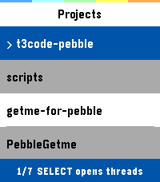
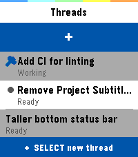
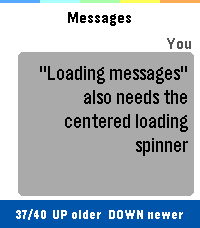
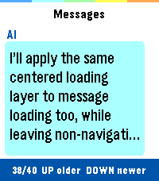

# T3 Code for Pebble

Vibecode from your wrist.

T3 Code for Pebble turns a Pebble Time 2 into a tiny remote control for your T3 Code workspace. Browse active projects, jump into threads, read the latest model responses, and dictate a new prompt without pulling out a laptop or phone.

It is not trying to be a full IDE on a 200x228 screen. It is a fast, glanceable way to keep an agent moving when you are away from your keyboard: check whether a thread is still working, skim the newest answer, or send the next instruction the moment it occurs to you.

## Install

Download a tagged PBW from [GitHub Releases](https://github.com/tylxr59/t3code-pebble/releases).

## Features

- **Wrist-first coding flow:** long-press `SELECT`, dictate a prompt, and send it into an existing or brand-new T3 Code thread.
- **Live workspace awareness:** projects and threads come from the active T3 Code shell snapshot, so the watch reflects what your remote instance is actually doing.
- **Agent check-ins without context switching:** glance at recent messages and thread status from the same device you already use for notifications.
- **Phone as the bridge, watch as the cockpit:** PebbleKitJS handles auth and WebSocket traffic through the paired phone while the watch keeps the UI simple and button-driven.
- **Built for Pebble Time 2:** color accents, compact lists, message bubbles, dictation, and button navigation are tuned for `emery`.

## Requirements

- Pebble Time 2 / `emery`
- A T3 Code instance reachable from the paired phone
- A fresh T3 Code pairing code for initial authentication
- Pebble SDK / Pebble Tool, only when building locally

## Screenshots

| Projects | Threads |
| --- | --- |
|  |  |

| User Message | AI Response |
| --- | --- |
|  |  |

## Setup

1. Expose T3 Code on a reachable address, for example `http://192.168.1.2:3773/`.
2. Generate a pairing token from T3 Code. On a headless T3 host, run:

   ```bash
   t3 auth pairing create --json
   ```

   Use the JSON output's `credential` value as the pairing code.
3. Open the app settings in the Pebble mobile app.
4. Enter the server URL and pairing code.
5. Tap **Authenticate** and wait for the status to show `Authenticated`.
6. Tap **Save**.

The pairing code is exchanged for a bearer session token and is not needed again unless the server session is revoked.

## What You Can Do

- Browse recent T3 Code projects.
- Open a project and inspect active, non-archived threads.
- Read the latest messages in a thread, including expanded message detail.
- Start a new thread from the watch.
- Dictate and send a new user message to the selected thread.
- Poll while a thread is working so the watch can update when the agent responds.

## Controls

- Project list: `UP` / `DOWN` moves, `SELECT` opens threads.
- Thread list: `UP` / `DOWN` moves, `SELECT` opens messages.
- Message list: `UP` / `DOWN` moves, `SELECT` expands the selected message.
- Message list: long-press `SELECT` starts Pebble dictation and sends the dictated text to the selected thread.
- Expanded message: `UP` / `DOWN` scrolls, `SELECT` returns to the message list.
- `BACK` moves up one level.

## Troubleshooting

- `Set server URL`: open settings and enter the T3 Code base URL.
- `Set pairing code`: open settings and enter a fresh pairing token.
- `Invalid bootstrap credential`: generate a new T3 Code pairing token; tokens are one-time credentials.
- `WS TIMEOUT` or `WS ERROR`: confirm the phone can reach the server URL and that T3 Code is still running.

## Development

```bash
npm ci
npm run build
```

The built app is written to `build/t3code-pebble.pbw`.

Install it in the Time 2 emulator with:

```bash
npm run install:emery
```

## Releases

Pushing a version tag such as `v0.1.4` runs the GitHub Actions release workflow:

```bash
npm ci
npm run lint
npm run build
```

`npm run lint` validates PebbleKitJS syntax, runs ESLint, and checks C formatting with
`clang-format`. The workflow verifies that the tag matches `package.json`, uploads the PBW as a workflow artifact, and attaches it to the matching GitHub Release.

To repair a missing or outdated PBW for an existing tag, open **Actions → Release PBW → Run workflow** and enter that tag. Manual runs check out the exact tag before rebuilding and replacing the release asset. Release current code with a new version and tag instead of reusing an older tag.

## Project Layout

```text
src/c/                 Pebble C app, state model, and interface
src/pkjs/              PebbleKitJS settings, authentication, and WebSocket bridge
screenshots/           Checked-in Pebble Time 2 screenshots
package.json           Pebble metadata, scripts, and message keys
wscript                Pebble SDK build script
pebble-appstore.md     Version-controlled proposed Pebble Appstore listing copy
```

## Protocol Notes

The app uses PebbleKitJS for all network access:

- `POST /oauth/token` exchanges the pairing code for a bearer access token.
- `POST /api/auth/websocket-ticket` issues a short-lived WebSocket ticket.
- `/ws?wsTicket=...` is used with T3 Code's tagged JSON RPC envelope protocol.

The app also retains fallback support for the legacy bootstrap, WebSocket-token, and `wsToken`
routes used by older T3 releases.

Only the required RPC subset is implemented:

- `orchestration.subscribeShell` for projects and threads, with `orchestration.getArchivedShellSnapshot` as a fallback.
- `orchestration.subscribeThread` for thread messages.
- `orchestration.dispatchCommand` for dictated `thread.turn.start` messages.

## License

T3 Code for Pebble is licensed under the [MIT License](LICENSE).
